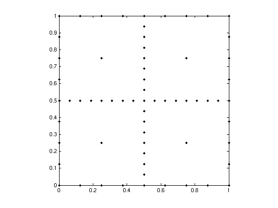
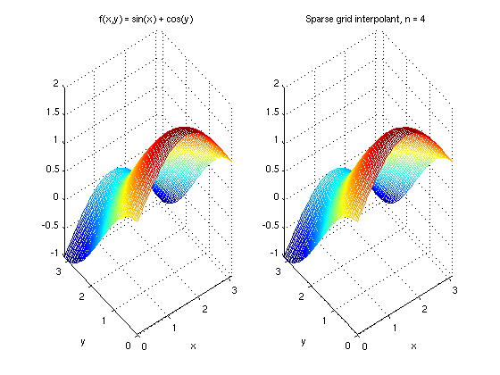

# Quick Start

## A first example

Consider interpolating the function

\[
f(x, y) = \sin(x) + \cos(y)
\]

over the domain $[0, \pi] \times [0, \pi]$ using the default **Clenshaw-Curtis** sparse grid.

### Step 1 — build the hierarchical surpluses

The sparse grid interpolant is assembled level by level.  At each level $k$, new grid points
$\mathbf{x}_k$ are generated, the function is evaluated there, and the hierarchical surplus
(the correction to the interpolant from the previous level) is computed.

```python
import numpy as np
import spinterp

d = 2                            # dimension
scale = np.array([np.pi, np.pi]) # domain [0,pi]^2

def f(x, y):
    return np.sin(x) + np.cos(y)

all_seq, all_surp = [], []

for k in range(5):               # levels 0 .. 4
    nl  = spinterp.spnlevels(k, d)
    seq = spinterp.spgetseq(k, d, nl)   # multi-index set, shape (nl, d)
    tp  = spinterp.spdim_cc(seq)
    x_k = spinterp.spgrid_cc(seq, tp)   # grid points in [0,1]^d, shape (tp, d)

    # Evaluate f at the scaled grid points
    fvals = np.array([f(*(x_k[i] * scale)) for i in range(tp)])

    if k == 0:
        surp_k = fvals.copy()
    else:
        z_prev   = np.concatenate(all_surp)
        seq_prev = np.vstack(all_seq)
        interp   = spinterp.spcmpvals_cc(z_prev, x_k, seq, seq_prev)
        surp_k   = fvals - interp

    all_seq.append(seq)
    all_surp.append(surp_k)

z   = np.concatenate(all_surp)   # flat surplus array
seq = np.vstack(all_seq)         # combined level-index matrix
```

### Step 2 — evaluate the interpolant

```python
rng  = np.random.default_rng(42)
pts  = rng.random((5, d)) * scale           # 5 random points in [0,pi]^2
pts_unit = pts / scale                       # normalise to [0,1]^2

ip = spinterp.spinterp_cc(z, pts_unit, seq)
exact = f(pts[:, 0], pts[:, 1])

print("Interpolated:", ip)
print("Exact:       ", exact)
print("Max error:   ", np.max(np.abs(ip - exact)))
```

Example output:

```
Interpolated: [0.641 1.765 0.278 0.832 1.113]
Exact:        [0.641 1.765 0.278 0.832 1.113]
Max error:    0.0047
```

### Step 3 — visualise the sparse grid

The sparse grid at level 4 in 2-D with Clenshaw-Curtis nodes:



And comparing the true function with the sparse grid interpolant:



---

## Grid types

Choose a different grid by swapping the `spgrid_*`, `spcmpvals_*`, and `spinterp_*` calls:

```python
# Chebyshev polynomial sparse grid
x_k  = spinterp.spgrid_cb(seq, tp)
interp = spinterp.spcmpvals_cb(z_prev, x_k, seq, seq_prev)
ip   = spinterp.spinterp_cb(z, pts_unit, seq)

# Gauss-Patterson
x_k  = spinterp.spgrid_gp(seq, tp)
interp = spinterp.spcmpvals_gp(z_prev, x_k, seq, seq_prev)
ip   = spinterp.spinterp_gp(z, pts_unit, seq)
```

---

## Derivatives

Request gradient vectors by calling `spderiv_cc` instead of `spinterp_cc`:

```python
ip, grad = spinterp.spderiv_cc(z, pts_unit, seq)
# grad.shape == (npoints, d)
print("df/dx1:", grad[:, 0])
print("df/dx2:", grad[:, 1])
```

See [Computing Derivatives](usage/derivatives.md) for the full discussion.

---

## Quadrature

Integrate $f$ over $[0,1]^d$ by dotting the quadrature weights with the surpluses:

```python
tp_all = sum(spinterp.spdim_cc(s) for s in all_seq)
w = spinterp.spquadw_cc(seq, tp_all)
integral = float(np.dot(w, z))
print("Integral ≈", integral)
```
