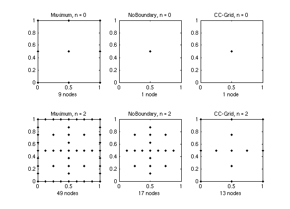

# Piecewise Linear Basis Functions

Piecewise linear basis functions provide a good compromise between accuracy and computational
cost due to their **bounded support**.  `spinterp` includes three grid types that use
piecewise multilinear bases:

| Code name | Description |
|---|---|
| `clenshaw-curtis` (CC) | Nested boundary-point set; single node at level 0 |
| `maximum` (M) | Maximum-norm grid; $3^d$ nodes at level 0 |
| `noboundary` (NB) | Interior-point grid; basis functions extrapolate towards boundary |

---

## Hierarchical hat functions

In 1-D, the hat function centred at $x_j$ with support width $h$ is

\[
\phi_j(x) = \max\!\left(1 - \frac{|x - x_j|}{h},\; 0\right).
\]

For the **Clenshaw-Curtis** grid the 1-D nodes at level $\ell$ are:

\[
x_j^{(\ell)} =
\begin{cases}
\dfrac{1}{2} & \ell = 0 \\
0,\;1 & \ell = 1 \\
\dfrac{2j-1}{2^\ell}, \quad j = 1, \dots, 2^{\ell-1} & \ell \geq 2
\end{cases}
\]

The **NoBoundary** grid uses only interior nodes $x_j^{(\ell)} = (2j-1)/2^{\ell+1}$ for
$j = 1, \dots, 2^\ell$ at every level, with hat functions that extrapolate linearly past the
boundary.

The **hierarchical surplus** $\alpha_j$ at node $x_j$ is the residual between the exact
function value and the interpolant already built from coarser levels:

\[
\alpha_j = f(x_j) - A_{\ell-1,1}(f)(x_j).
\]

The full $d$-dimensional interpolant is then

\[
A_{n,d}(f)(\mathbf{x})
= \sum_{\mathbf{l}} \sum_{j} \alpha_j \prod_{k=1}^{d} \phi_{j_k}^{(\ell_k)}(x_k)
\]

where the outer sum runs over all active multi-indices $\mathbf{l}$ in the Smolyak set.

---

## Error estimate

For a function $f$ that possesses bounded mixed partial derivatives of order 2 in each
coordinate, i.e.

\[
\left\|\frac{\partial^{2d} f}{\partial x_1^2 \cdots \partial x_d^2}\right\|_\infty \leq C,
\]

the interpolation error of the sparse grid $A_{q,d}(f)$ in the maximum norm is

\[
\|f - A_{q,d}(f)\|_\infty
= O\!\left(N^{-2}\,(\log N)^{\,2(d-1)}\right)
\]

where $N$ is the number of support nodes.  The corresponding full-grid estimate with the
same $N^* \approx N$ nodes is only $O(N^{*\,-2/d})$, which deteriorates rapidly with
dimension.  The sparse grid retains the $N^{-2}$ rate, paying only a logarithmic price.

---

## Grid point counts

The table below gives the number of grid points for the three piecewise-linear grid types.

| $n$ | M ($d=2$) | NB ($d=2$) | CC ($d=2$) | M ($d=4$) | NB ($d=4$) | CC ($d=4$) | M ($d=8$) | NB ($d=8$) | CC ($d=8$) |
|---|---|---|---|---|---|---|---|---|---|
| 0 | 9 | 1 | 1 | 81 | 1 | 1 | 6561 | 1 | 1 |
| 1 | 21 | 5 | 5 | 297 | 9 | 9 | 41553 | 17 | 17 |
| 2 | 49 | 17 | 13 | 945 | 49 | 41 | 1.9e5 | 161 | 145 |
| 3 | 113 | 49 | 29 | 2769 | 209 | 137 | 7.7e5 | 1121 | 849 |
| 4 | 257 | 129 | 65 | 7681 | 769 | 401 | 2.8e6 | 6401 | 3937 |
| 5 | 577 | 321 | 145 | 20481 | 2561 | 1105 | 9.3e6 | 31745 | 15713 |
| 6 | 1281 | 769 | 321 | 52993 | 7937 | 2929 | 3.0e7 | 141569 | 56737 |
| 7 | 2817 | 1793 | 705 | 1.3e5 | 23297 | 7537 | 9.1e7 | 5.8e5 | 1.9e5 |

---

## Visual comparison

The figure below shows the sparse grids of levels 0 and 2 for all three grid types in two
dimensions.

---

## Which grid type to choose?

- **Clenshaw-Curtis** is the most versatile choice and the only grid type for which the
  dimension-adaptive algorithm is currently implemented.  Recommended for most problems.

- **NoBoundary** can outperform CC when the objective function is known to be non-zero at
  the domain boundary and the boundary nodes of CC do not contribute meaningful information.

- **Maximum** has $3^d$ nodes at level 0, making it impractical for $d > 10$
  ($d = 10$ already requires 59049 nodes for the initial interpolant).  Suitable only for
  low-dimensional problems.
