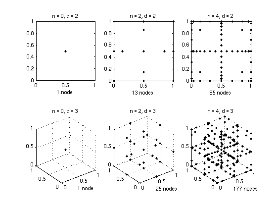

# Polynomial Basis Functions

The piecewise multilinear approach can be significantly improved by using **higher-order**
basis functions, specifically the Lagrange characteristic polynomials.  For smooth objective
functions, polynomial sparse grid interpolation achieves spectral convergence rates.

---

## Chebyshev-Gauss-Lobatto (CGL) grid

The natural choice for polynomial sparse grid interpolation is the set of
**Chebyshev-Gauss-Lobatto** nodes (also called Chebyshev extrema), because:

1. They are well-conditioned for high-degree polynomial interpolation (Lebesgue constant
   grows logarithmically).
2. They form a **nested hierarchy**: the nodes at level $\ell$ include all nodes from
   levels $0, 1, \dots, \ell-1$.
3. The resulting sparse grid has the same number of points as the Clenshaw-Curtis grid.

The 1-D nodes at level $\ell$ are

\[
x_j^{(\ell)} =
\begin{cases}
\dfrac{1}{2} & \ell = 0 \\
0,\;1 & \ell = 1 \\
\dfrac{1}{2} - \dfrac{1}{2}\cos\!\left(\dfrac{(2j-1)\pi}{2^\ell}\right),
\quad j = 1, \dots, 2^{\ell-1} & \ell \geq 2
\end{cases}
\]

Barycentric Lagrange interpolation and the discrete cosine transform (DCT) are used
internally for efficient evaluation and surplus computation.

---

## Gauss-Patterson grid

Since version 5.0, the **Gauss-Patterson** sparse grid is available.  It is based on the
abscissae of the Gauss-Patterson nested quadrature rule, which achieves a higher degree of
polynomial exactness than the CGL nodes for integration purposes.  The maximum supported
depth is 6.

The 1-D Gauss-Patterson nodes at level $\ell$ include $2^{\ell+1}-1$ nodes total (all
nodes from levels $0, \dots, \ell$ in a nested fashion).

---

## Error estimate

Define the function class

\[
\mathcal{F}_d^k = \left\{
  f : [0,1]^d \to \mathbb{R}
  \;\middle|\;
  \left\|\frac{\partial^{|\boldsymbol{\alpha}|} f}{\partial x^{\boldsymbol{\alpha}}}\right\|_\infty
  \leq C_{\boldsymbol{\alpha}},\;
  |\boldsymbol{\alpha}|_\infty \leq k
\right\}
\]

i.e. all mixed partial derivatives up to order $k$ in each coordinate are bounded.  For
$f \in \mathcal{F}_d^k$, the CGL sparse grid interpolant $A_{q,d}(f)$ satisfies

\[
\|f - A_{q,d}(f)\|_\infty
= O\!\left(N^{-k}\,(\log N)^{(k+1)(d-1)}\right)
\]

where $N$ is the number of CGL support nodes.  Compared to the piecewise-linear rate
$N^{-2}(\log N)^{2(d-1)}$, the polynomial basis achieves the higher rate $N^{-k}$ for
smooth functions ($k > 2$).

---

## Grid point counts

The number of grid points of the **CGL grid** equals that of the Clenshaw-Curtis (CC) grid
(see [Linear Basis Functions](linear-basis.md)).

The **Gauss-Patterson grid** has the same point counts as the NoBoundary (NB) grid.

The figure below shows the CGL sparse grids at levels 0 and 2 in two and three dimensions.

---

## When to use polynomial basis functions?

There is a trade-off between accuracy gain and the computing time required both to construct
and to evaluate the interpolant.  The higher-order accuracy only becomes effective with
increasing number of nodes.  We recommend polynomial basis functions when **both** of the
following conditions are met:

- The objective function is known to be **very smooth** (analytic or at least $C^k$ for
  large $k$).
- **High relative accuracies** smaller than $10^{-2}$ are required.

For lower accuracies or functions with limited smoothness, the piecewise-linear
Clenshaw-Curtis grid is generally the better choice.
