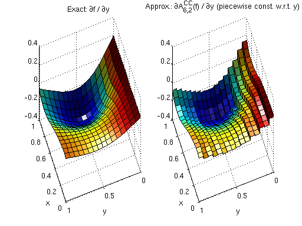
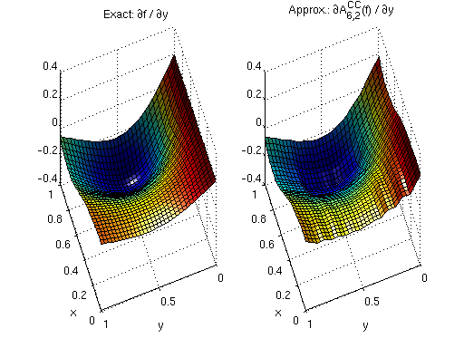
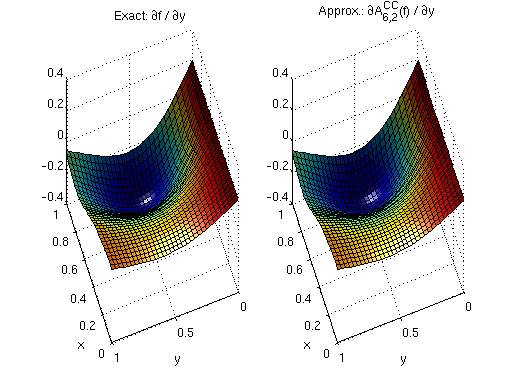
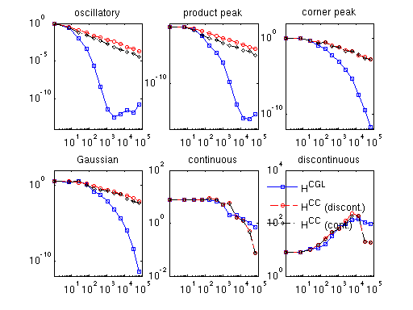
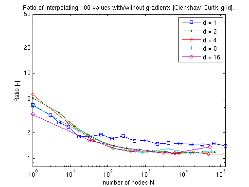
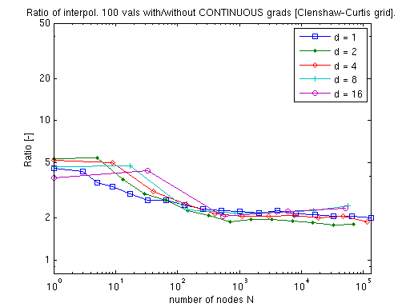
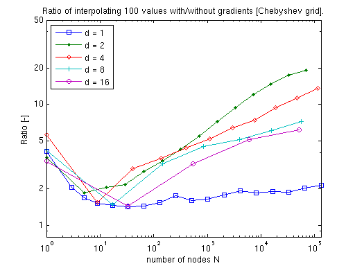
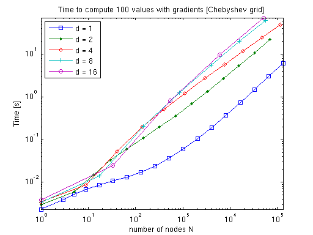

# Computing Derivatives

One primary purpose of sparse grid interpolation is constructing **surrogate functions** for
local or global optimisation.  `spinterp` computes exact derivatives of the interpolant —
not finite-difference approximations — at almost no additional memory cost.

---

## How to obtain derivatives

Call `spderiv_cc` (or `spderiv_cb` for the Chebyshev grid) instead of `spinterp_cc`.  The
function returns both the interpolated values **and** the full gradient vector:

```python
import spinterp

# ip.shape  = (npoints,)
# grad.shape = (npoints, d)
ip, grad = spinterp.spderiv_cc(z, pts_unit, seq)
```

The procedure for building the surpluses `z` and level-index matrix `seq` is identical
regardless of whether derivatives are needed.

!!! note
    The computed derivatives are the **exact** derivatives of the interpolant (up to
    floating-point accuracy), not approximations of the derivatives of the original
    function $f$.  No additional memory is required.

---

## Derivatives of piecewise multilinear interpolants

Differentiating a piecewise linear function yields a **piecewise constant** function.  The
derivatives are exact everywhere except at the kinks (the grid nodes), where only a
one-sided derivative exists.

### Example — 2-D function

Consider the test function

\[
f(x, y) = \frac{1}{\cos^2(2x) + \sin^2(y) + 1} + 0.2\,y
\]

with exact partial derivatives

\[
\frac{\partial f}{\partial x} =
  -\frac{4\cos(2x)\sin(2x)}{(\cos^2(2x) + \sin^2(y) + 1)^2},
\qquad
\frac{\partial f}{\partial y} =
  \frac{-2\cos(y)\sin(y)}{(\cos^2(2x) + \sin^2(y) + 1)^2} + 0.2.
\]

The figure below compares $\partial f / \partial y$ (left, exact) with the sparse grid
derivative $\partial A^{\text{CC}}_{6,2}(f) / \partial y$ (right, piecewise constant with
visible jumps at level-4 grid nodes):



---

## Augmented continuous derivatives

Discontinuous derivatives make first-order optimality conditions $\nabla f = \mathbf{0}$
impossible to satisfy exactly, leading to slow convergence in gradient-based optimisation.

The **continuous derivative** option linearly interpolates the piecewise-constant
derivative between two augmented evaluation points $y_1$ and $y_2$ on either side of each
grid cell:

\[
\frac{\partial A}{\partial x_k}\bigg|_\text{cont}(y)
= \frac{\partial A}{\partial x_k}(y_1)
  + \frac{\dfrac{\partial A}{\partial x_k}(y_2) -
           \dfrac{\partial A}{\partial x_k}(y_1)}{\Delta}
    (y - y_1)
\]

where $\Delta$ is the cell width $1/2^{\ell_{\max}}$.

Use `spcont_deriv_cc` followed by `pp_deriv` to obtain continuous derivatives:

```python
maxlev = int(seq[:, 0].max())
ip, ipder, ipder2 = spinterp.spcont_deriv_cc(z, pts_unit, seq, maxlev)
# pp_deriv post-processes ipder in-place using ipder2
import numpy as np
maxlevvec = np.full(d, maxlev, dtype=np.int32)
spinterp.pp_deriv(
    np.asfortranarray(ipder),
    np.asfortranarray(ipder2),
    maxlevvec,
    np.asfortranarray(pts_unit)
)
```

The figure below shows the same derivative after the continuity post-processing:



---

## Derivatives of polynomial interpolants

For the Chebyshev-Gauss-Lobatto grid, the basis functions are globally smooth polynomials.
The derivatives are computed via the **discrete cosine transform (DCT)**, using the
`spderiv_cb` function:

```python
ip, grad = spinterp.spderiv_cb(z_cb, pts_unit, seq)
```

The resulting derivatives are infinitely smooth:



---

## Approximation quality

The figure below shows the maximum absolute error of the derivatives for six standard
Genz test functions at 100 randomly sampled points for dimension $d = 3$:

- **H$^\text{CC}$** — piecewise constant, Clenshaw-Curtis grid
- **H$^\text{CC}$ (cont.)** — augmented continuous, Clenshaw-Curtis grid
- **H$^\text{CGL}$** — smooth polynomial, Chebyshev grid



!!! note
    Functions with kinks (labelled *continuous* and *discontinuous*) cannot have their
    derivatives approximated in the maximum norm: convergence fails near the kinks.
    The error decreases in the plot only because the randomly sampled points are less
    likely to land near the (shrinking) non-convergent region.

---

## Computational cost

### Clenshaw-Curtis

Computing the exact or augmented continuous gradient adds only a small, dimension-independent
factor over plain interpolation:




### Chebyshev

The polynomial case requires more sophisticated algorithms.  However, as the dimension
increases, fewer subgrids need differentiation (lower-dimensional subgrids omit the
dimensions they do not span), so the overhead decreases:




For comparison, numerical differentiation with a centred-difference formula would require
$2d + 1$ interpolant evaluations per gradient — the analytic approach is substantially
cheaper for moderate to large $d$.
