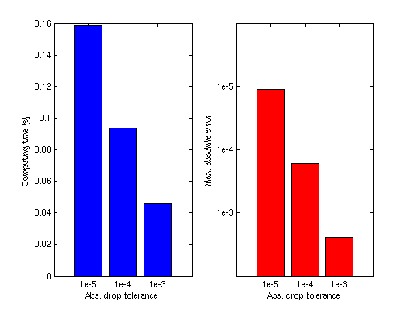

# Improving Performance

## Overview

This section covers the main strategies for making `spinterp` faster:

1. Vectorising the objective function
2. Reusing previously computed results
3. Purging redundant interpolant data
4. Vectorised interpolant evaluation

---

## Vectorising the objective function

Vectorisation is most beneficial when function evaluations are cheap ($\lesssim 10^{-2}$ s
each).  Consider the function

\[
f(x_1, x_2) = (x_1\, x_2)^2.
\]

A non-vectorised implementation evaluates one point at a time:

```python
def f(x1, x2):
    return (x1 * x2) ** 2
```

A vectorised implementation processes a whole array in one call:

```python
import numpy as np
def f_vec(x1, x2):
    return (x1 * x2) ** 2      # NumPy broadcasts automatically
```

When passing a vectorised function, the grid points are delivered as full arrays, avoiding
per-point Python call overhead.  For cheap functions, this can give a **2×** or better
speed-up when computing surpluses.

---

## Reusing previous results

The hierarchical surplus structure means that a higher-level interpolant is a strict
extension of a lower-level one.  You never need to recompute previously computed levels.

The recommended pattern is to build the interpolant in a loop, checking the estimated error
after each level:

```python
import numpy as np
import spinterp

def f_vec(x1, x2):
    return (x1 * x2) ** 2

d, n_max = 2, 8
all_seq, all_surp = [], []
est_err = np.inf

for k in range(n_max + 1):
    nl  = spinterp.spnlevels(k, d)
    seq = spinterp.spgetseq(k, d, nl)
    tp  = spinterp.spdim_cc(seq)
    x_k = spinterp.spgrid_cc(seq, tp)
    fvals = np.array([f_vec(*x_k[i]) for i in range(tp)])

    if k == 0:
        surp = fvals.copy()
    else:
        z_prev   = np.concatenate(all_surp)
        seq_prev = np.vstack(all_seq)
        surp = fvals - spinterp.spcmpvals_cc(z_prev, x_k, seq, seq_prev)

    all_seq.append(seq)
    all_surp.append(surp)

    # Estimated error = max |surplus| / (max |f| + eps)
    est_err = np.max(np.abs(surp)) / (np.max(np.abs(fvals)) + 1e-14)
    print(f"level {k}: {tp} new pts, est. rel. error = {est_err:.3e}")

    if est_err < 1e-4:
        break
```

Example output for a smooth function:

```
level 0:    1 new pts, est. rel. error = 1.000e+00
level 1:    4 new pts, est. rel. error = 3.750e-01
level 2:    8 new pts, est. rel. error = 4.688e-02
level 3:   16 new pts, est. rel. error = 2.930e-03
level 4:   28 new pts, est. rel. error = 8.545e-05
```

---

## Purging interpolant data

After the interpolant is built, subgrids whose hierarchical surpluses are all below a
**drop tolerance** can be excluded from evaluation without significantly affecting accuracy.
This is the `sppurge` concept from the original MATLAB toolbox.

A simple Python equivalent: keep only subgrids where $|\alpha_{\mathbf{l}}|_\infty$ exceeds
a threshold:

```python
import numpy as np
import spinterp

d         = 2
max_level = 6

def f(x, y):
    return np.sin(x) + np.cos(y)

# Build hierarchical surpluses (Clenshaw-Curtis grid)
all_seq, all_surp = [], []
for k in range(max_level + 1):
    nl  = spinterp.spnlevels(k, d)
    seq = spinterp.spgetseq(k, d, nl)
    tp  = spinterp.spdim_cc(seq)
    x_k = spinterp.spgrid_cc(seq, tp)
    fvals = np.array([f(*x_k[i]) for i in range(tp)])
    if k == 0:
        surp_k = fvals.copy()
    else:
        z_prev   = np.concatenate(all_surp)
        seq_prev = np.vstack(all_seq)
        surp_k   = fvals - spinterp.spcmpvals_cc(z_prev, x_k, seq, seq_prev)
    all_seq.append(seq)
    all_surp.append(surp_k)

# Purge subgrids whose surpluses are all below the drop tolerance
drop_tol = 1e-5
keep = [
    (s, surp)
    for s, surp in zip(all_seq, all_surp)
    if np.max(np.abs(surp)) > drop_tol
]
seq_pruned = np.vstack([s    for s, _    in keep])
z_pruned   = np.concatenate([surp for _, surp in keep])

print(f"Original subgrids: {len(all_seq)},  after purge: {len(keep)}")
print(f"Original surpluses: {sum(len(s) for s in all_surp)},  after purge: {len(z_pruned)}")
```

The trade-off: smaller `drop_tol` → higher accuracy, slower evaluation.  Typical savings
are 2–5× speedup at the cost of $\sim 10^{-4}$ relative accuracy degradation when
`drop_tol = 1e-5`.



---

## Vectorised interpolant evaluation

The `spinterp_cc` (and related) functions are designed for **batch evaluation**: passing
all query points as a single 2-D array is far more efficient than one-point-at-a-time
calls.

```python
import numpy as np
import spinterp

d         = 2
max_level = 4

def f(x, y):
    return np.sin(x) + np.cos(y)

# Build hierarchical surpluses (Clenshaw-Curtis grid)
all_seq, all_surp = [], []
for k in range(max_level + 1):
    nl  = spinterp.spnlevels(k, d)
    seq = spinterp.spgetseq(k, d, nl)
    tp  = spinterp.spdim_cc(seq)
    x_k = spinterp.spgrid_cc(seq, tp)
    fvals = np.array([f(*x_k[i]) for i in range(tp)])
    if k == 0:
        surp_k = fvals.copy()
    else:
        z_prev   = np.concatenate(all_surp)
        seq_prev = np.vstack(all_seq)
        surp_k   = fvals - spinterp.spcmpvals_cc(z_prev, x_k, seq, seq_prev)
    all_seq.append(seq)
    all_surp.append(surp_k)

z   = np.concatenate(all_surp)
seq = np.vstack(all_seq)

rng = np.random.default_rng(0)
pts = rng.random((1000, d))

# Slow — Python loop over 1000 points
results_slow = [spinterp.spinterp_cc(z, pts[i:i+1], seq)[0] for i in range(1000)]

# Fast — single batched call
results_fast = spinterp.spinterp_cc(z, pts, seq)   # pts.shape = (1000, d)

print(f"Max diff slow vs fast: {np.max(np.abs(np.array(results_slow) - results_fast)):.2e}")
```

Typical speed-up: **50–100×** for 1000 points, due to reduced Python overhead and better
cache utilisation in the Fortran kernel.

---

## Summary of tips

| Tip | When to apply | Typical benefit |
|---|---|---|
| Vectorise the objective function | Cheap functions ($< 10^{-2}$ s/eval) | 2–10× faster `spcmpvals` |
| Build levels incrementally | Always | Avoids recomputing surpluses |
| Purge small-surplus subgrids | After convergence, if evaluation speed matters | 2–5× faster `spinterp` |
| Batch query points | Always | 50–100× faster `spinterp` |
| Use sparse index format | $d > 10$ | Lower memory, faster iteration |
